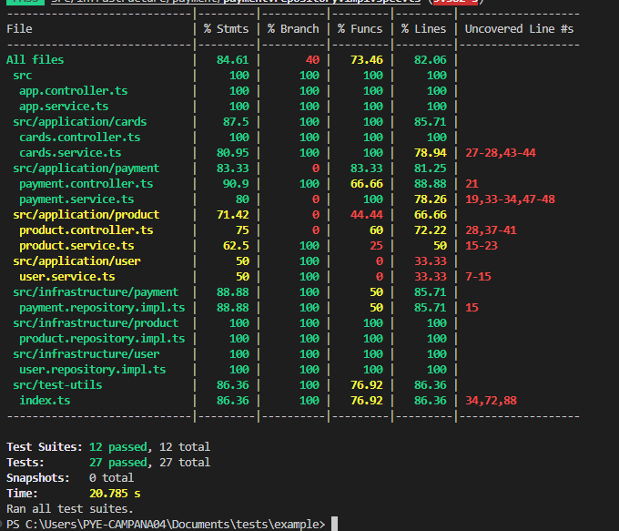

## Url- https://wompi-back-production.up.railway.app/

## Documentación de api - https://wompi-back-production.up.railway.app/docs
# Pasos para instalar y correr el proyecto;

- bajar los cambios del repositorio https://github.com/napandalesr/wompi-back
- ejecutar npm install
- ejecutar npm start:dev

### Se dejan las variables de entorno en el archivo .env y se comparten en github

# Arquitectura
- Hexagonal

